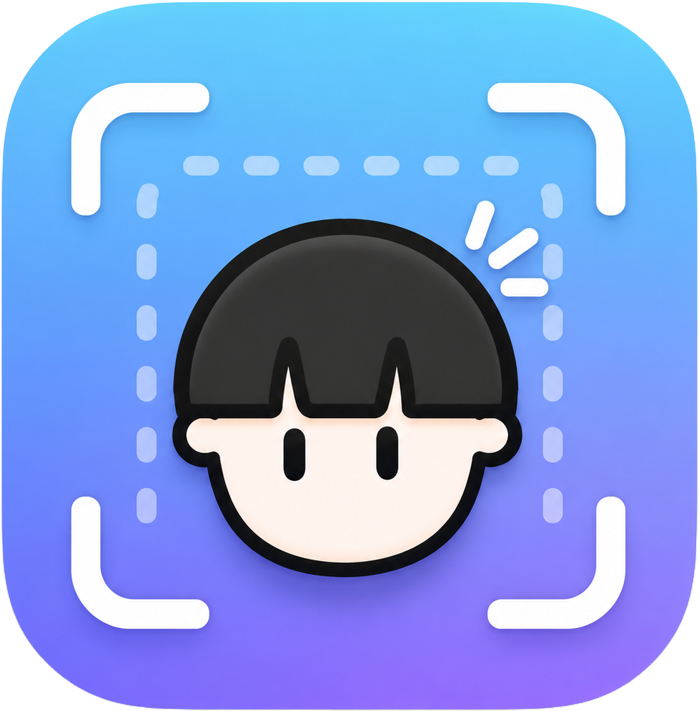

  

<h1 align="center">oh-my-opensnap 📸</h1>

빠르고 정밀한 **macOS 화면 캡처 도구**. 영역을 픽셀 단위로 집어 캡처하고, 곧바로 클립보드에 복사하고, 캡처본을 라이브러리에 모아 표시·크롭까지 한 곳에서.

> macOS 26 (Tahoe) 이상 · 메뉴 막대 상주 · 무료 / 오픈소스

---

## 🎬 데모 영상

  

▶️ <a href="https://youtu.be/pIil-Nt7zA4">YouTube에서 보기</a>

---

## 왜 만들었나

저는 **9년째 IT 도서를 기획하고 편집**하는 편집자입니다. 하루에 화면 캡처만 **500장, 많을 땐 1,000장**을 찍습니다. 캡처는 제 일의 절반입니다.

그래서 좋은 캡처 프로그램이라면 **돈을 주고서라도** 써 왔습니다. 캡처 속도·정밀함·뒷정리가 곧 제 생산성이니까요.

이제는 매일 수백 장을 찍는 사람의 손에 맞춘 그 도구를 **직접 만들어, 무료로 배포**합니다. 그게 oh-my-opensnap입니다.

---

## 📥 설치

1. [**Releases**](../../releases/latest) 에서 최신 `.dmg` 파일을 받습니다.
2. `.dmg` 를 열고 **`oh-my-opensnap` 아이콘을 `Applications` 폴더로 드래그**합니다.
3. `Applications` 폴더에서 앱을 실행합니다.
4. 첫 캡처 때 뜨는 **화면 녹화 권한**을 켭니다
   (시스템 설정 → 개인정보 보호 및 보안 → 화면 및 시스템 오디오 녹화 → `oh-my-opensnap` ON).

> 앱과 DMG는 Apple Developer ID로 서명되고 공증되어 배포됩니다. 일반적인 설치 과정에서는 “확인되지 않은 개발자” 우회가 필요하지 않습니다.

> 그림과 함께 한 단계씩 따라 하려면 👉 [INSTALL.md](INSTALL.md)

설치 후에는 앱이 **자동으로 업데이트를 확인**합니다(Sparkle). 새 버전이 나오면 알림이 뜨고 클릭 한 번으로 갱신됩니다. 메뉴바 → **업데이트 확인…** 으로 수동 확인도 가능합니다.

---

## ✨ 주요 기능

- **정밀 영역 캡처**: 전체 화면 디밍 + 크로스헤어 + 라이브 확대경(픽셀 격자·좌표·HEX 색상), 실시간 W×H(px) 표시
- **즉시 클립보드 복사** — 캡처와 동시에 붙여넣기 준비 완료. 수백 장을 빠르게 쳐내기 위한 흐름
- **라이브러리 + 편집기** — 캡처본을 모아 다시 보고, 번호·화살표·도형으로 표시하거나 크롭
- 멀티 디스플레이 / Retina 대응

---

## 🧭 메뉴 막대 메뉴

메뉴 막대의 카메라 아이콘(📷)을 누르면:

| 메뉴 | 단축키 | 설명 |
|---|---|---|
| **캡처** | `⌘⇧2` | 영역 캡처 시작 (드래그로 범위 지정, `Esc` 취소) |
| **라이브러리…** | `⌘L` | 캡처 보관함 + 편집기 열기 |
| **설정…** | `⌘,` | 캡처 단축키 변경 · 파일 저장 옵션/폴더 · 캡처 사운드 on/off |
| **종료** | `⌘Q` | 앱 종료 |

---

## 🖼 라이브러리 편집기 사용법

`⌘L` 로 라이브러리를 열면 왼쪽에 캡처 목록(썸네일), 오른쪽에 미리보기/편집 화면이 나옵니다.
캡처 직후엔 방금 찍은 이미지가 자동으로 선택되고, 창 크기도 이미지에 맞게 조절됩니다.

**상단 도구 막대**

| 도구 | 설명 |
|---|---|
| 🔘 선택 | 편집 안 함(보기 전용) |
| ✂️ 크롭 | 드래그로 영역 지정 → `⏎`(또는 완료)로 잘라내기 |
| ➊ 번호 | 클릭할 때마다 1→9 순서로 동글 번호 찍기. 번호가 커서를 따라다니다 클릭한 자리에 찍힘 |
| ↗️ 화살표 | 드래그로 화살표 |
| ⬛ 사각형 / ⬭ 원 | 드래그로 도형 |
| 🎨 색 / 굵기 | 표시 색상·선 굵기 |
| ↩️ 되돌리기 | 마지막 작업 취소 (`⌘Z`, **크롭도 되돌려짐**) |
| 💾 저장 / 📁 Finder / 🗑 삭제 | 다른 곳에 저장 · Finder에서 보기 · 휴지통 |

**알아두면 편한 단축키 / 동작**

- 도형 그릴 때 **`⇧`** 누르고 드래그 → 사각형·원은 1:1, 화살표는 45° 반듯하게
- **`⌘Z`** 되돌리기 · **`⌘C`** 현재 화면 복사
- **`⌘ +` / `⌘ -` / `⌘ 0`** 확대 / 축소 / 창에 맞춤 (`⌘`+스크롤도 가능)
- 썸네일 **우클릭 → Finder에서 보기**

---

캡처본은 **바탕화면의 `oh-my-opensnap` 폴더**에 PNG로 보관됩니다.
